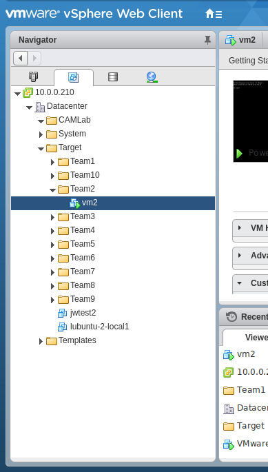
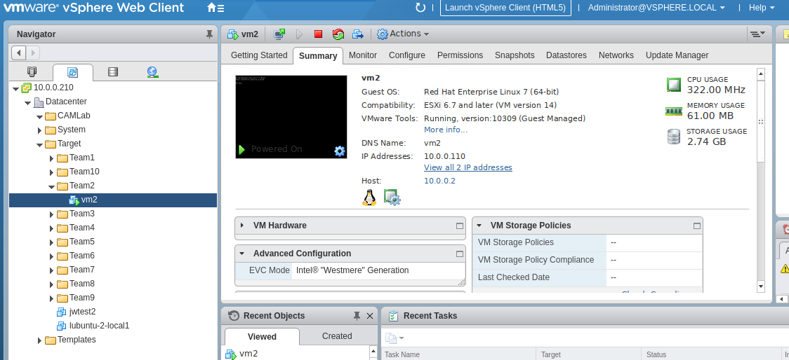
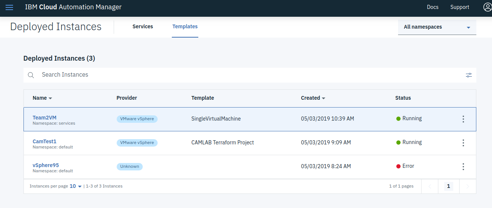
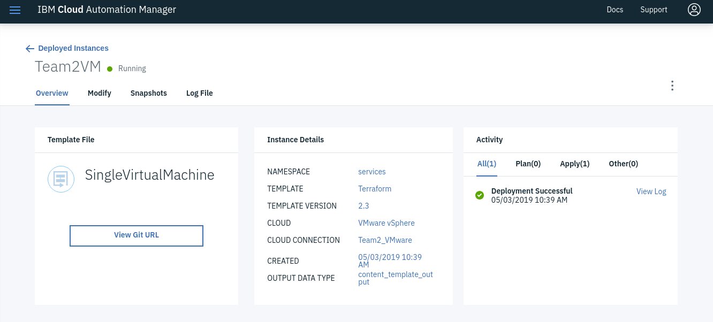
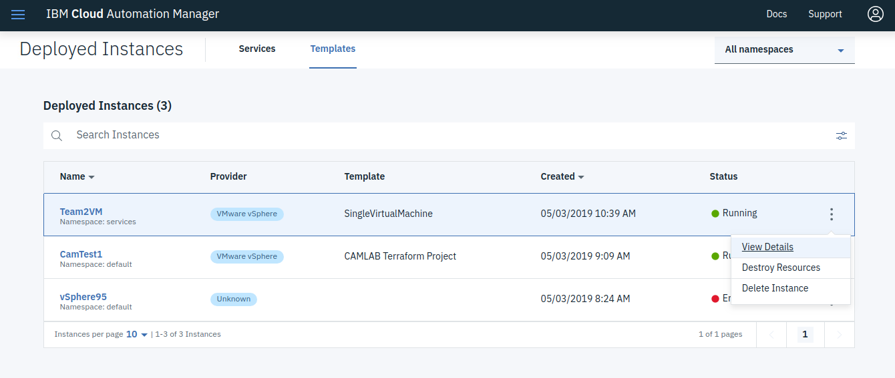
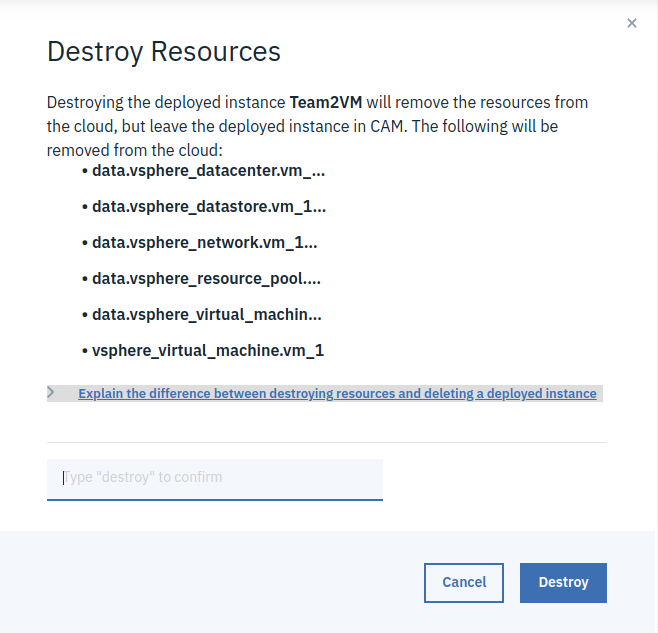

# CAM and vSphere User Interfaces

### Review VM in vSphere:

1. Open vSphere, using the link in your chrome browser and login with the user **administrator@vsphere.local** and password **Passw0rd!**.

​	Https://10.0.0.210/vsphere-client/?csp

2. Open the *Navigator* tab, if it's not already open.  Go to the VM's and Templates tab in the navigator open 10.0.0.210 > Datacenter > Target > Team # > Team#VM

​			

3. In the Panel to the right of the Navigator will be a view of the VM just created.

### Review UI for deployed instance:

1. Goto Deployed Instances > Templates.  here you will see the VM instance you created.  It should be up and running

2. Then Under Deployed Instances > Templates, select the Instance you just finished creating 

   **Team#VM**

   

3. Once selected you will be presented with the Deployed Instance Template User interface.  There are a number of things you can do from  this screen.

​		

4. Once selected you will be presented with the Deployed Instance Template User interface.  There are a number of things you can do from  this screen.

5. In the upper let hand side, you will notice 4 main tab's 

   ​	Overview, Modify, Snapshots and Log File

   - **Overview:**

     In this tab you can see the Template Name, Instance Details and Activity.  you can also see the 	  Resource Details.

   - **Modify:**

     In this tab you modify the current template and apply those changes.

   - **Snapshots:**

     In this Tab you can capture and revert to different states  of a Virtual Machine.

   - **Log File:**

     In this tab you can review the log file from the create, plan and  deploy of the templates.  If there are any 	errors, you can expand those and review the issues

### **Cleaning up**

1. Go back to the Deployed Instances > Templates, on the right band side of your instance, select the 3 dot's icon and you will then see 3 options

   *View Details*, *Destroy Resources* and *Delete Instance*

2. The View Details option will bring you to the opening page of your VM.

3. To Clean up your instance you will use the *Destroy Resources* and the *Delete Instance*.  They are executed in the following order

   ​	1) Destroy Resource

   ​	2) Delete Instance

4. Select **Destroy Resource**.  This will bring up a dialog box and you will have to type "destroy" into the highlighted input box and then Click **Destroy**

   

5. Select **Delete Instance**. This will bring up a dialog box and you will have to type "delete" into the highlighted input box and then Click **Delete**

   

