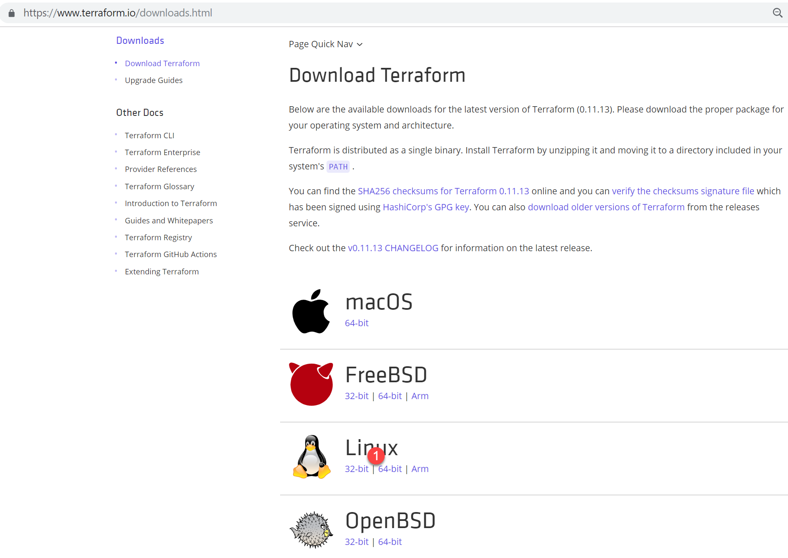

# Terraform Install

# Readying your environment

In this section we will install the Terraform binary, which will be used in subsequent labs. 

Execute all the following from the **Boot** node.

1. Launch the web browser and load the following URL

   <https://www.terraform.io/> 
   
2. Click on the **Download x.xx.xx** button, which will bring up a screen similar to this ...

      

3. Locate the **Linux** version and right click on the 64-bit link and choose **Copy link address**

4. Launch the terminal emulator that can be found on the desktop and connect as root using

   ```
   sudo su -
   ```

5. Create a new folder to store the downloaded Terraform binary

   ```
   mkdir Terraform
   ```

6. Change to the terraform working directory

   ```
   cd Terraform
   ```

7. Pull down the Terraform binary

   ```
   wget <link_copied_in_step_3>
   ```
   NOTE: Due to unknown results from terraform updates affecting the labs, it is probably safer to use the following version
   https://releases.hashicorp.com/terraform/0.12.0/terraform_0.12.0_linux_amd64.zip

8. Extract the newly download zip file using 

   ```
   unzip <name_of_zip file>
   E.g. unzip terraform_0.11.13_linux_amd64.zip
   ```

9. You should now have the original zip file and a binary called **terraform**. This needs to be moved to a folder which is in the users path. Do this by running 

   ```
   mv terraform /usr/local/bin/.
   ```

10. Check that terraform is installed correctly by running the following

    ```
    terraform -version
    ```

11. Remove the downloaded zip file

    ```
    rm <name_of_zip file>
    ```
