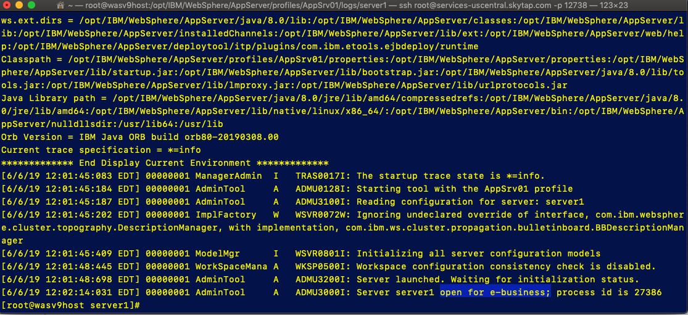
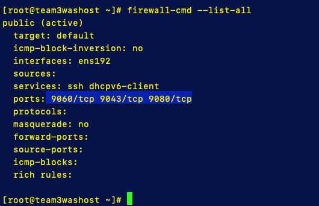
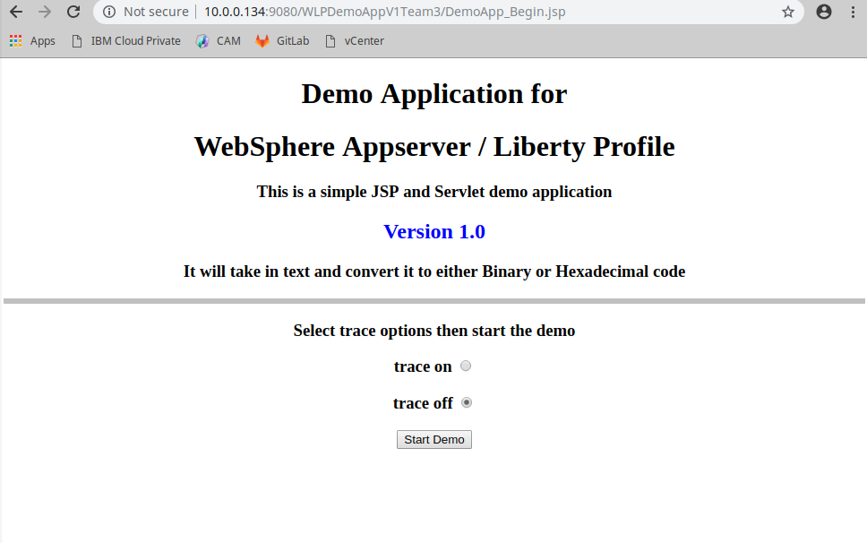

### Deploy the WAS VM template

In this lab we are going to use the Content Runtime Server we installed to automate the installation of a Websphere Application Server (WAS).

**Note:** This lab should be executed from the **Boot** node.

1. Login to the CAM console

2. Navigate to the CAM WebSphere template library

   **Menu** > **Library** > **Templates**

3. Select **Middleware**

4. In search bar, enter **WebSphere**

5. Scroll through templates until you find the following template:

   **IBM WebSphere Network Deployment V9 on single virtual machine**  for **VMware vSphere** provider

6. Deploy the template with the following parameters:

   - Instance Name - **team#was9vm**

   - Name space - **services**

   - Cloud Connection - **Team#-VMware**

   - Select Data Objects - 

     - Bastion host - **<use the default value>**
     - HTTP proxy Config - **<use the default value>**
     - Advanced Content Runtime Chef -  **team#_CR_Server**

   - Cloud Input Variables 

     - vSphere Cluster - WASnode01: **DatacenterCluster**
     - vSphere Datacenter - WASNode01:  **Datacenter**
     - vSphere Folder Name - WASNode01: **Target/Team#**

   -  SSH-Keys : **None**

   - Virtual Machine

     - DNS Servers - WASnode01: **8.8.8.8**
     - DNS suffixes - WASNode01: **cam.local**
     - Domain Name - WASNode01: **cam.local**
     - Operating System ID / Template - WASnode01: **rhels76-template**
     - Operating System username - WASNode01: **root**
     - Operating System password - WASNode01:  **passw0rd**
     - Root Disk Size - WASNode01: default - **100**
     - Short hostname - WASNode01: **team#washost**
     - Template Disk Datastore - WASNode01:  **D_S01_L01_500G** or **D_S02_L01_500G**
     - Virtual Machine Gateway Address - WASNode01:  **10.0.0.254**
     - Virtual Machine IP address - WASNode01: 1**0.0.0.{within team IP range}**
     - Virtual Machine Memory - WASNode01:  default - **4096**
     - Virtual Machine Netmask prefix - WASNode01:  **24**
     - Virtual Machine vCPU's - WASNode01:  default - **2**
     - Virtual Machine vSphere Port Group - WASNode01: **VM Network**
     - vSphere Network Adapter Type - WASNode01: **vmxnet3**
     - vSphere Resource Pool - WASNode01:  **CAMPool**

   - WASNode01

     - WebSphere Application Server version : **9.0.0.4**
     
     - WebSphere Application Server cell name:  **cell01**
     
     - WebSphere Application Server max JVM Heap Size: **512**
     
     - WebSphere Application Server profile name:  **AppSrv01**
     
     - WebSphere Java SDK version:  **8.0.5.35**
     
     - WebSphere administrative user name:  **wasadmin**

     - WebSphere administrative password:  **passw0rd**
     
     - WebSphere default keystore password:  **passw0rd**
     
     - WebSphere Installation userid:  **wasadmin**
     
     - WebSp[here profile location:  **/opt/IBM/WebSphere/AppServer/profile**
     
     - WebSphere user group[ name: **wasgrp**
     
       

   7. Click **Deploy** and monitor your deployment

   

### 2. Check WAS VM

If the Template has deployed successfully, you should have a virtual machine with WebSphere Application Server installed and  up and running. 

##### Check the status of the WAS App Server

1. SSH into the App Server vm

   ```
   ssh root@10.0.0.(WAS App Server vm IP)
   ```

2. Change to the profile directory

   ```
   cd /opt/IBM/WebSphere/AppServer/profiles/AppSrv01/logs/server1
   ```

3. Check startServer log, run

   ```
   cat startServer.log
   ```

   You should see "**open for e-business**" at the bottom of the log

   


##### Update the firewall rules for the WebSphere Admin Console

1. Run the commands below to open the port for the WAS Admin Console

   ```
   firewall-cmd --permanent --add-port=9060/tcp
   firewall-cmd --permanent --add-port=9043/tcp
   firewall-cmd --permanent --add-port=9080/tcp
   ```

2. Reload the firewall rules

   ```
   firewall-cmd --reload
   ```

3. Verify the rules are active

   ```
   firewall-cmd --list-all
   ```

   You should see the following output

   ​	

4. Next we will open the WAS Admin Console 

   - On the Chrome web browser from the Boot Node and navigate to the URL below:

     **https://10.0.0.<WAS VM IP>:9060/ibm/console**

   - Login with the credentials below

     User id = wasadmin

     Password = passw0rd

### 3. Deploy simple application

1. Copy Sample WAS Application to WAS VM

   - From the boot node copy the sample application .war file to the new WAS virtual machine

     ```
     scp ~/Documents/cam-admin-bootcamp/WAS_App/WLPDemoApp1.0.war root@10.0.0.<WAS VM IP>:/opt/IBM/WebSphere/AppServer/profiles/AppSrv01/installableApps
     ```

2. Open WebSphere admin console

   - On the Chrome web browser from the Boot Node and navigate to the URL below:

     **https://10.0.0.<WAS VM IP>:9060/ibm/console**

   - Login with the credentials below

     User id = wasadmin

     Password = passw0rd

3. In the admin console go to **Application > New Application**

   - Select **New Enterprise Application**

   - Select **Remote File System** (you are running the admin console remotely from your WAS VM )

     - Browse, select **team#washosteNode01**

     - Drive down into the **/opt/IBM/WebSphere/AppServer/profiles/AppSrv01/installableApps** directory

     - Select the **WLPDemoApp1.0.war** file

       

     - Select **OK**

     - Select **Next**

     - Select **Fast Path**, then **Next**

     - Step 1 Select **Next**

     - Step 2 Select **WLPDempApp**, then **Next**

     - Step 3 Select **WLPDemoApp**, then **Next**

     - Step 4 enter **WLPDemoAppV1Team#** for context root, then **Next**

     - Step 5 select **Next**

     - Step 6 select **Finish**

     - Select **save** to save the changes to the master configuration

4. Restart the WebSphere server

   - SSH into WebSphere virtual machine

     ```
     ssh root@10.0.0.<WAS VM IP>
     ```

   - Change directory to the  App Server bin directory

     ```
     cd /opt/IBM/WebSphere/AppServer/profiles/AppSrv01/bin
     ```

   - Stop the server

     ```
     ./stopServer.sh server1
     ```

     You should see the following output

     

     

   - Start the server

     ```
     ./startServer.sh server1
     ```
     
     You should see the following output
     
     

   

5. Make sure App is started

   - On the Boot Node return to the Chrome broswere where you have the WebSphere Amin Console open

   - Navigate to **Applications > Application Types** and then select **WebSphere enterprise applications**

   - You should see a green arrow next to the **WLPDemoApp1_0_war**

     

6. Open the Application

   - From the Chrome browser navigate to the URL below:

     **10.0.0.<WAS VM IP>:9080/WLPDemoAppV1Team#/DemoApp_Begin.jsp**

     You should see the following out put
     
     

#### Lab Completion Clean Up

To remove the instances used during this lab and the previous one, first remove the WAS VM via CAM **Menu** -> **Deployed Instances** -> **Templates**.

Next remove the content runtime VM using via CAM **Menu** -> **Manage** -> **Content Runtimes**. Click on the 3 dots to the right of the instance created and click on '**Destroy Resources**' followed by '**Delete Instance**' 

