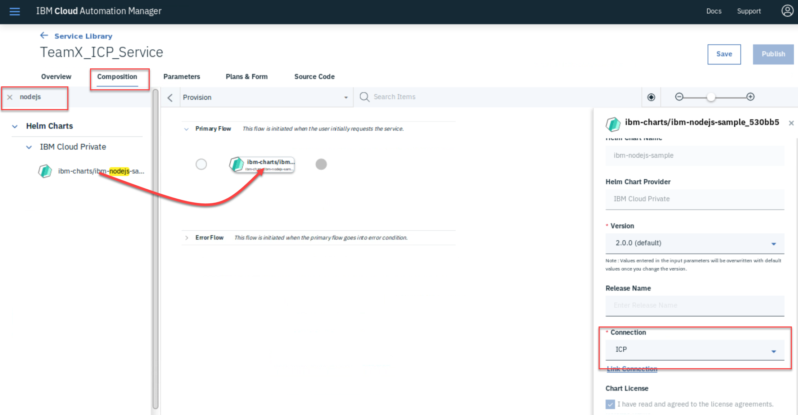
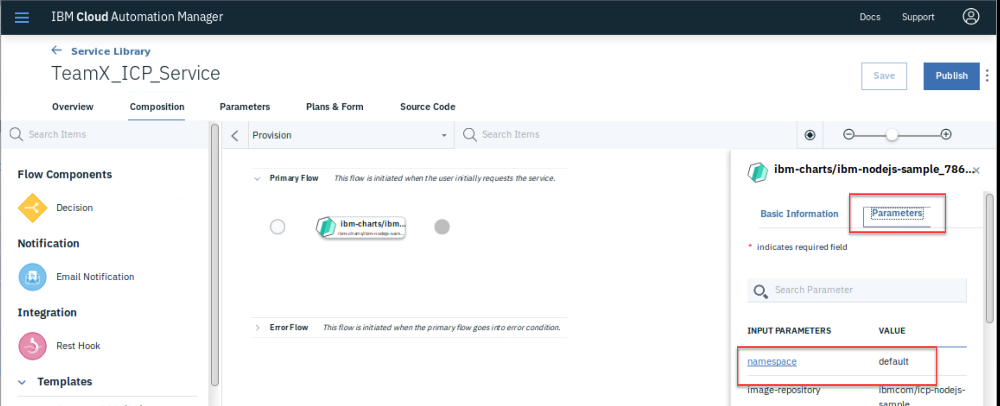
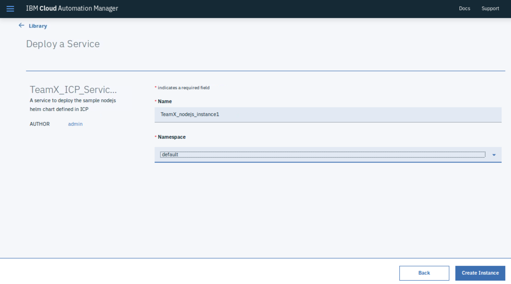
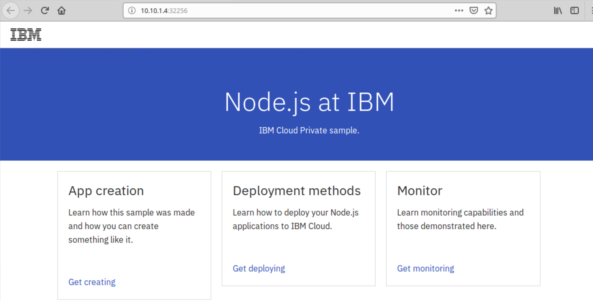

# Deploy Service to ICP

In this lab you will be creating a new CAM service which will deploy a pre-existing helm chart defined in the ICP catalog.

All activities will be carried out on the Boot node using the Web browser on the desktop. 

## Create a new Cloud Connection to ICP
First we need to create a connection from CAM to ICP. This is achieved by doing the following.

Login into the IBM Cloud Automation Manager UI (using admin/passw0rd).

Using Menu -> Manage -> Cloud Connections, click on **Create Connection**, and enter the following ...

```
  Cloud Provider: IBM Cloud Private
  Connection Name: TeamX_ICP_Connection (where 'X' is your team number)
  Connection Description: Connection to the same ICP instance as the one used by CAM
  IBM Cloud Private username: admin
  IBM Cloud Private password: passw0rd
  IBM Cloud Private Ip/hostname: <empty> (this directs it to use the same ICP system that is used by CAM)
```

## Create a new Service

Using Menu -> Library -> Services, click on **Create a Service** called **TeamX_ICP_Service** where 'X' is your team number.

Under the **Composition** tab, search for nodejs, which should find the Helm chart already defined in ICP.

NOTE: If the helm chart is not found, refresh the catalog in ICP by logging into the ICP UI, and selecting Menu -> Manage -> Helm Repositories, then choosiing **Sync repositories** and try again.



Drag and drop the **ibm-nodejs-sample** chart into the Primary Flow between the two circles.

In the details panel on the righthand side, select the Cloud Connection created in the first step.

In the same righthand panel, click on the **Parameters** tab and change the **namepsace** to **default**.



**Save** the service.


## Deploy the new Service

From the Menu -> Library -> Services, find the new service you just created and select **Deploy** from its action dropdown list (3 dots).

Choose a name with nodejs in it so that it will be easier to find in the next step.



Check that the instance is deployed successfully and then launch the ICP UI. 

Under Menu -> Workloads -> Helm Releases, search for the instance you just deployed (nodejs).

Click on the **Launch** link which will bring up a new browser window connected to the running application.


If all has gone to plan, you should see something similar to this ...



#### Lab Completion Clean Up

To remove the nodejs instance, find it under the Menu -> Deployed Instances -> Services, then click on the action dropdown (3 dots to right of the instance) and select 'Terminate' followed by 'Delete'.

